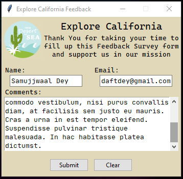
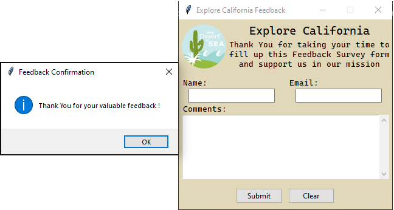
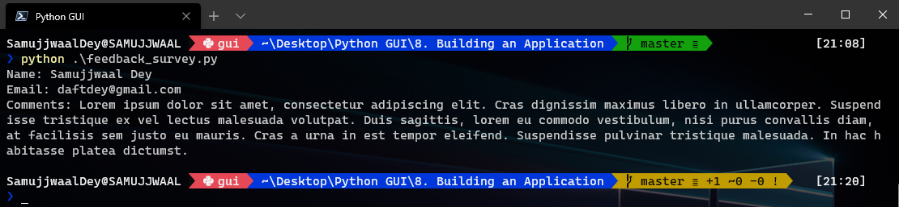

# Python GUI Development with Tkinter

This repository was created to maintain code written while working on the course [Python GUI Development with Tkinter](https://www.linkedin.com/learning/python-gui-development-with-tkinter-2) on LinkedIn Learning.

## Repo Organization

A folder has been created for each chapter of the course, as indicated by it's chapter number and chapter name. Each folder contains executable python scripts for the concepts and code written in the corresponding chapter.

## GUI Requirements

To create a feedback survey form for the fictional tours company [Explore California](http://explorecalifornia.org/).

Requirements:

1. Display logo and instructions to user.
2. Following input fields:
   - Name
   - Email address
   - Multiline comments
3. Two Buttons:
   - Submit
     - Prints contents of input fields to the console
     - Empty contents of input fields
     - Notify user the feedback was submitted
   - Clear
     - Empty the input fields

## Usage details

To execute the python scripts, clone the repository using the following command in the terminal:

`git clone https://github.com/samujjwaal/Tkinter-GUI-Course.git`

Open the folder and execute the python script(s).

The final GUI created as part of the course is available in this [folder](8.%20Building%20an%20Application).

## Execution Output

[This](8.%20Building%20an%20Application/feedback_survey.py) is the script for the final GUI.

Execute the script using: `python feedback_survey.py`

    

    

    

